روش تاپسیس یکی  از تکنیک‌های مورد استفاده در تصمیم‌گیری چند معیاره (MCDM) است. در این روش تصمیم‌گیری تعدادی گزینه و تعدادی معیار برای تصمیم‌گیری وجود دارد که باید با توجه به معیارها، گزینه‌ها رتبه‌بندی شوند، و یا اینکه به هر یک از آنها یک نمره کارایی اختصاص داده شود. فلسفه کلی روش تاپسیس این است که با استفاده از گزینه‌های موجود، دو گزینه فرضی تعریف می‌شوند. یکی از این گزینه‌ها مجموعه‌ای است از بهترین مقادیر مشاهده شده در ماتریس تصمیم‌گیری. این گزینه‌ را اصطلاحاً ایده‌آل مثبت (بهترین حالت ممکن) می‌نامیم. ضمن اینکه یک گزینه فرضی دیگر تعریف می‌شود که شامل بدترین حالت‌های ممکن باشد. این گزینه ایده‌آل منفی نام دارد. معیارها می‌تواند دارای ماهیت مثبت یا منفی باشند، همچنین واحد اندازه‌گیری آنها نیز می‌تواند متفاوت باشد.

معیار محاسبه نمرات در روش تاپسیس این است که گزینه‌ها تا حد امکان به گزینه ایده‌آل مثبت نزدیک و از گزینه ایده‌آل منفی دور باشد. بر این اساس یک نمره برای هر گزینه محاسبه می‌شود و گزینه‌ها مطابق این نمرات رتبه بندی می‌شوند.

در مثال زیر مراحل و نحوه استفاده از این روش نشان داده شده است:

مثال: قرار است که ساخت یک سد به یکی از سه پیمانکار موجود واگذار شود. این پیمانکاران هر یک طرحی را برای ساخت سد پیشنهاد داده‌اند. پیمانکار اول متشکل از پرسنل اجرایی وزارتخانه است (A1)، پیمانکار دوم یک شرکت داخلی است (A2) و پیمانکار سوم یک پیمانکار خارجی است (A3). تصمیم‌گیری برای انتخاب پیمانکار باتوجه به هزینه اجرای طرح (X1)، استحکام طرح (X2)، وجه ملی (X3)، ظرفیت سد (X4) و سختی اجرا (X5) صورت می‌گیرد و ماتریس تصمیم‌گیری زیر اطلاعات مسئله را نشان می‌دهد.

ماتریس تصمیم گیری تاپسیس

باید توجه شود که هزینه و سختی، شاخص‌های منفی هستند.

مراحل حل مسئله:

مرحله صفر: مرحله آماده‌سازی ماتریس تصمیم‌گیری است. در این مرحله باید شاخص‌های غیرعددی و عبارتهای کلامی به مقادیر عددی تبدیل شوند. توجه به جنبه مثبت و منفی بودن شاخص‌ها ضروری است.

 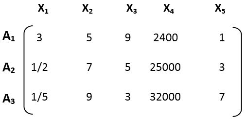
 

 به خاطر داشته باشید که اگر متغیرهای کلامی مربوط به معیارهای منفی (مثل سختی‌کار) به روش معکوس معادل‌سازی شوند (مثلا به کارهای سخت‌تر امتیاز کمتر اختصاص یابد). پس از معادل‌سازی این شاخص‌ها نیز به شاخص‌های مستقیم یا مثبت تبدیل می‌شوند. یعنی هرچه‌قدر مقدار عددی بیشتر باشد گزینه مطلوب‌تر است. در جدول حاضر X1 یک شاخص عددی با ماهیت منفی است و سایر شاخص‌ها مثبت هستند.

مرحله 1: ماتریس تصمیم گیری (D) را با استفاده از رابطه زیر به ماتریس تصمیم‌گیری نرمال تبدیل می‌کنیم (در این رابطه rij نشان‌دهنده امتیاز کسب شده توسط گزینه i در معیار j است).

 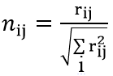
 

به عبارتی دیگر ابتدا برای هر ستون مجموع توان دوم مقادیر محاسبه شده و هر یک از درایه‌های ماتریس بر جذر مجموع توان دوم تقسیم می‌شوند.

 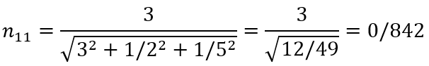
 

به‌همین ترتیب همه مقادیر را حساب می‌کنیم.

 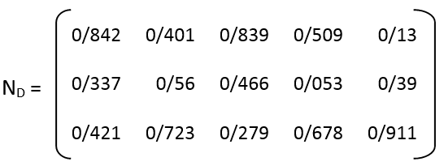
 

مرحله 2: محاسبه ماتریس نرمال یا مقیاس موزون؛ برای انجام این مرحله باید به هر یک از معیارها یک وزن اختصاص داده شود. این وزن می‌تواند مستقیما توسط تصمیم‌گیرنده انتخاب شود به‌نحوی که هر یک از وزن‌ها بین صفر تا یک باشد و مجموع وزن‌ها برابر با یک باشد و یا اینکه می‌توان با استفاده از روش‌هایی مثل مقایسات زوجی و AHP، وزن معیارها را به‌دست آورد. فرض کنید در  این مثال بردار وزن معیارها به شرح زیر باشد.

 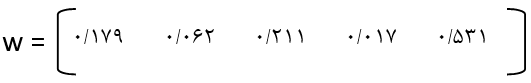
 

این بردار به یک ماتریس قطری تبدیل می‌شود یعنی ماتریسی nxn که وزن‌ها روی قطر اصلی آن قرار دارند و سایر درایه‌های ماتریس صفر است.

 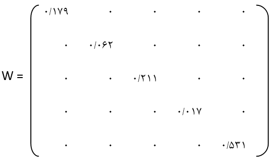
 

ماتریس بی‌مقیاس موزون که با نماد (V) نمایش داده می‌شود با استفاده از رابطه زیر به‌دست می‌آید:

 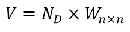
 

بنابراین

 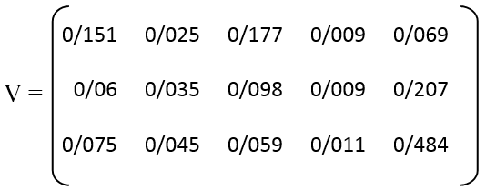
 

مرحله 3: تعیین نمودن گزینه‌های فرضی ایده‌آل مثبت و ایده‌ال منفی؛ برای تشکیل گزینه ایده‌آل مثبت (A+)باید در هر یک از ستون‌های ماتریس V بهترین مقدار انتخاب شود یعنی اگر شاخص متناظر با آن ستون جنبه منفی داشت (مثل هزینه) کمترین مقدار انتخاب شود و چنانچه جنبه مثبت داشت بیشترین مقدار انتخاب گردد. برای مثال اخیر داریم:

 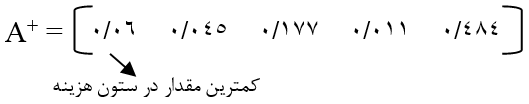
 

ستون اول چون هزینه است کمترین مقدار را انتخاب می‌کنیم که 06/0 انتخاب می‌شود. سختی کار با وجود اینکه یک شاخص منفی است به دلیل نوع امتیازدهی به یک شاخص مثبت تبدیل می‌شود. برای تشکیل جواب ایده‌آل منفی برعکس A+ عمل می‌کنیم. یعنی در ستون شاخص‌های منفی بیشترین مقدار و در سایر ستونها کمترین مقدار را انتخاب می‌کنیم.

 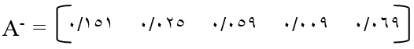
 

مرحله 4: فاصله هر یک از گزینه‌ها را تا گزینه ایده‌آل مثبت و گزینه ایده‌آل منفی حساب می‌کنیم. برای این منظور از اطلاعات ماتریس V استفاده می‌کنیم.

فاصله گزینه I تا ایده‌آل مثبت را با نماد di+ و تا ایده‌آل منفی را با نماد di- نشان می‌دهند.

 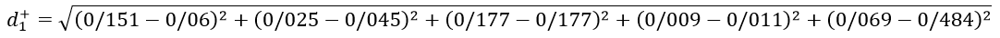
 

این محاسبه برای سطر اول از ماتریس V می‌باشد. برای هر کدام از سطرها این محاسبات را انجام می‌دهیم. نتایج به‌دست آمده به شرح جدول زیر می‌باشد.

 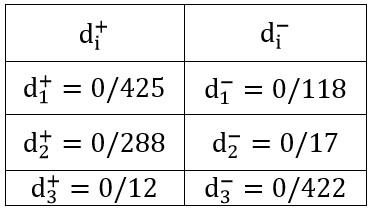
 

مرحله 5: محاسبه نمرات (نسبت نزدیکی به گزینه ایده‌آل)؛ نسبت نزدیکی به گزینه ایده‌آل که با نماد (CLi) نمایش داده می‌شود، برابر است با:

 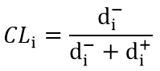
 

نتایج حاصل برای این مثال عبارتند از:

 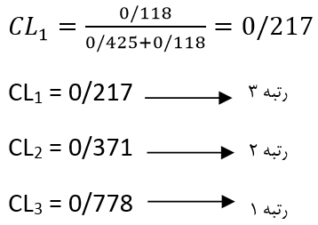
 

نهایتا باید گزینه‌ها را با توجه به مقدار CLi رتبه‌بندی کنیم. هرچه قدر مقدار CLi بیشتر باشد گزینه مورد نظر مطلوب‌تر است.
